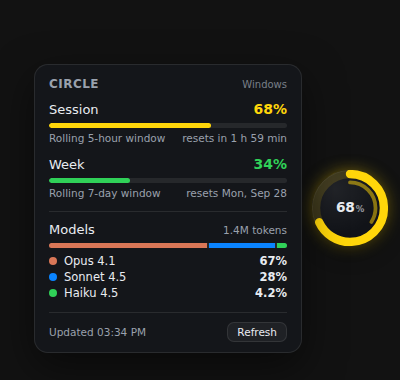
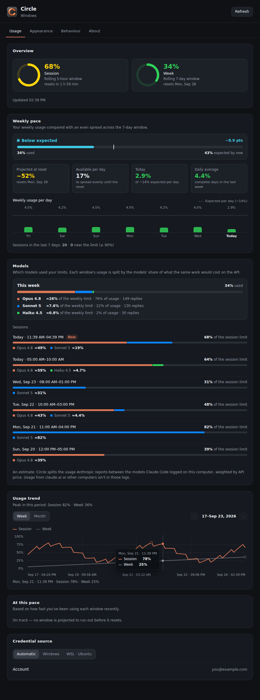
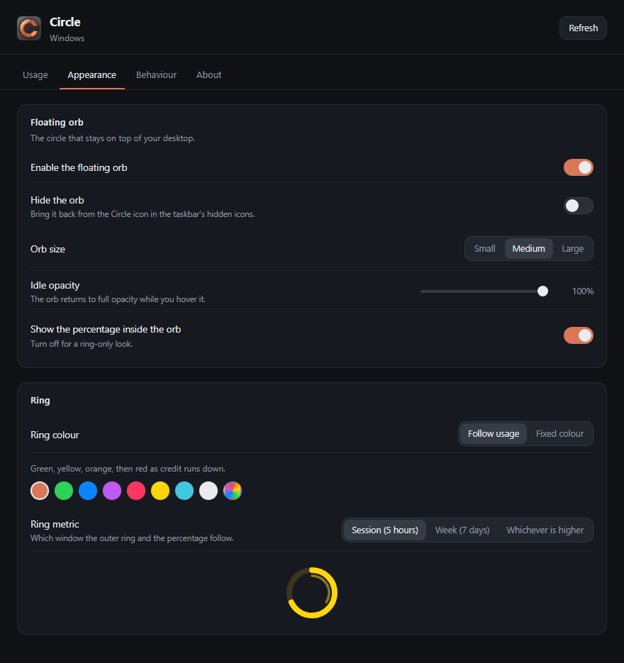
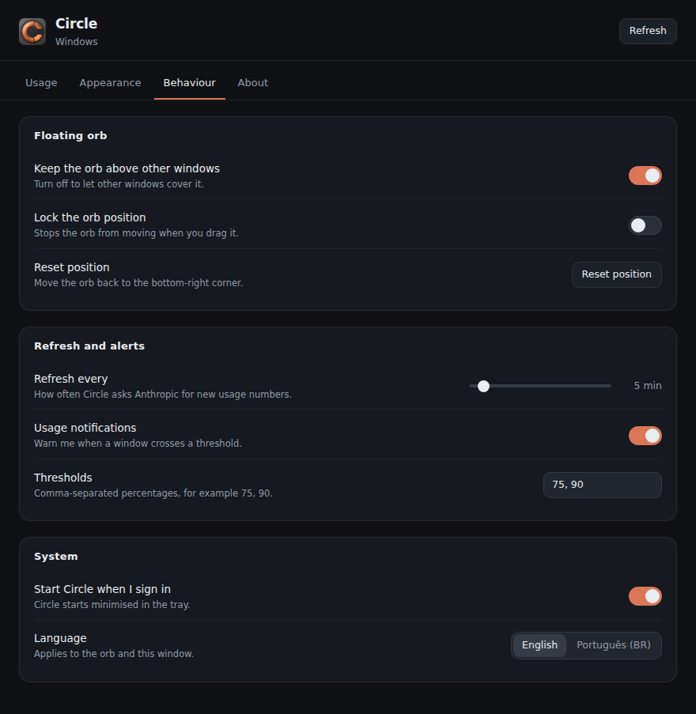

<h1 align="center">Circle</h1>

<p align="center"><em>Your Claude usage, as a circle that floats on your desktop.</em></p>

<p align="center">
  
</p>

<p align="center">
  <a href="LICENSE"></a>
  
  
</p>

---

Claude Code tells you that you have hit a limit only once you have hit it. Circle
puts the number where you can see it the whole time: a small ring that sits on
top of your desktop, fills up as your credit runs down, and turns from green to
red before you run out.

It reads the credentials Claude Code already stored on your machine, asks
Anthropic for your current usage, and draws it. No account, no server, no
telemetry.

Inspired by [Metria](https://github.com/yurirxmos/metria), which does the same
job as a menu bar app on macOS. Circle is the Windows answer, shaped like its
name.

## Contents

- [Features](#features)
- [Requirements](#requirements)
- [Install](#install)
- [Using Circle](#using-circle)
- [Settings](#settings)
- [How it works](#how-it-works)
- [Troubleshooting](#troubleshooting)
- [Build from source](#build-from-source)
- [Project layout](#project-layout)
- [Privacy](#privacy)
- [Contributing](#contributing)
- [Licence](#licence)

## Features

**A floating orb.** A circular, always-on-top widget with a progress ring. The
outer ring follows the window you choose; a dimmer inner ring shows the other
one, so both are readable at a glance. Everything except the orb itself is
click-through, so it never blocks what is behind it.

**Hover for the detail.** Pointing at the orb opens a card with the percentage
used in your **session** (rolling 5 hours) and in the **week** (rolling 7 days),
each with a bar and the time until it resets. Weekly Opus usage appears too when
Anthropic reports it.

**Colour that means something.** By default the ring runs green → yellow →
orange → red as credit runs down. Prefer a fixed colour? Pick one of eight
presets or any custom colour, and the ring stays that colour whatever your usage.

**Hide it, get it back from the taskbar.** Hiding the orb leaves a tray icon —
which is itself a small ring showing your usage. Click it in the taskbar's
hidden icons to bring the orb back.

**Threshold notifications.** Circle warns you once when a window crosses 75% and
again at 90% — both configurable — and rearms when usage drops back down.

**A seven-day trend.** Circle keeps its readings locally and plots the last week,
with the peak for each window.

**Weekly pace and forecasts.** Circle tells you whether your weekly usage is
within, above or below what an even spread across the 7-day window predicts,
projects where the week lands when it resets, and shows how much you can use per
day until then — next to today's usage, your daily average, a per-day breakdown
of the last week and how many sessions ran close to their limit.

**Which model spent it.** Circle reads the model and token counts Claude Code
logs for every reply and splits your weekly and session usage between the models
that ran — "Opus 4.8 ≈26% of the weekly limit, Sonnet 5 ≈8%" — for the current
week and for each session window of the last seven days.

**WSL aware.** Claude Code on Windows often lives inside WSL. Circle finds the
credentials in either place, and lets you pin which one to read.

**English and Brazilian Portuguese**, switchable in Settings.

## Requirements

- Windows 10 or 11.
- [Claude Code](https://claude.com/claude-code) installed and signed in, either
  on Windows or inside a WSL distribution.
- A Claude plan with usage limits — Circle reports what Anthropic reports.

Node.js 22+ and npm are needed only if you build from source. Linux builds are
produced and work, but Windows is the supported target.

## Install

1. Download `Circle-Setup-<version>-x64.exe` from the
   [Releases](https://github.com/Pedrxnes/circle/releases) page, or
   [build it yourself](#build-from-source).
2. Run the installer and launch Circle.
3. The orb appears near the bottom-right corner of your primary display, and a
   Circle icon appears in the notification area.

The installer is not signed with a code-signing certificate yet, so Windows
SmartScreen may warn you the first time. Choose **More info → Run anyway**.

## Using Circle

| To do this | Do that |
| --- | --- |
| **See the numbers** | Hover the orb. The panel opens beside it with session and weekly usage, and each window's reset time. |
| **Open Settings** | Click the orb. Or right-click the tray icon and choose **Open settings**. |
| **Move the orb** | Drag it anywhere. Circle remembers where you left it, and the hover panel flips to whichever side has room. |
| **Hide the orb** | Settings → Appearance → **Hide the orb**, or right-click the tray icon → **Hide orb**. |
| **Get it back** | Click the Circle icon in the taskbar's hidden icons (the `^` arrow next to the clock). One click brings the orb back. |
| **Turn the orb off entirely** | Settings → Appearance → **Enable the floating orb**. Circle keeps running in the tray, with usage in the icon and its tooltip. |
| **Change the colour** | Settings → Appearance → **Ring**. Switch to *Fixed colour* and pick a swatch, or use the colour wheel for any colour you like. |
| **Refresh now** | Click **Refresh** in the hover panel, in Settings, or in the tray menu. |
| **Quit** | Tray icon → **Quit**, or Settings → About → **Quit**. |

The orb also stays out of your way: it is click-through everywhere except the
orb itself, so clicking near it hits whatever is behind it, not Circle.

## Settings

Click the orb to open Settings.

### Usage



Per-window gauges, the weekly pace, the seven-day trend, the account your token
belongs to, and which credential source to read — automatic, Windows, or a
specific WSL distro.

**Weekly pace** compares the weekly percentage with where an even spread would
put it by now, given how much of the window has elapsed before its reset. Within
5 points either way counts as *within expected*; more is *above expected* (you
are spending credit faster than the week allows) and less is *below expected*
(credit to spare). Under it sit the usage projected for the reset at the current
burn rate, the credit available per day to spread what is left evenly, today's
usage and the daily average against the even daily share (~14%), a bar per day
for the last seven days with that share drawn as a dashed line, and the number
of sessions in the last week, including those that peaked at 90% or more.

The trend chart is readable point by point: percentages run down its side,
timestamps run underneath, and hovering (or focusing it and using the arrow
keys) pins a readout with the exact date, time and both percentages of the
reading under the pointer. The highest reading of each window is ringed, so the
peaks are easy to spot.

### Appearance



Enable or hide the orb, its size, idle opacity, whether the percentage is
printed inside it, the ring colour mode and accent, and which window the ring
follows. A live preview sits under the colour controls.

### Behaviour



Always-on-top, lock position, reset position, refresh interval, notification
thresholds, start with Windows, and the interface language.

## How it works

Claude Code stores an OAuth token in `~/.claude/.credentials.json` — on Windows
that is `%USERPROFILE%\.claude\.credentials.json`, and `CLAUDE_CONFIG_DIR`
overrides the directory when you have set it. Circle reads that token at runtime
and calls Anthropic's usage endpoint with it:

```http
GET https://api.anthropic.com/api/oauth/usage
Authorization: Bearer <token>
anthropic-beta: oauth-2025-04-20
```

The response reports `five_hour`, `seven_day` and, on some plans,
`seven_day_opus`, each with a utilisation percentage and a reset timestamp.
Circle polls it every five minutes by default, backs off when rate limited, and
reads again whenever the machine wakes from sleep.

**WSL.** Circle lists your distributions with `wsl.exe --list --quiet` and checks
each for the credential file. If both a Windows and a WSL install are found,
Settings → Usage lets you pin which one to read.

**Circle never writes to the credential file** and never refreshes the token
itself — Claude Code owns it. If the stored token has expired, Circle says so and
asks you to sign in again rather than rotating it behind Claude Code's back.

**Models.** Anthropic's endpoint only reports percentages, so the model split
comes from Claude Code's session transcripts in `~/.claude/projects` (and
`~/.config/claude/projects`; inside WSL, through `\\wsl.localhost`). Circle keeps
only each reply's model, timestamp and token counts, prices them at Anthropic's
API rates, and gives every model its share of the window's percentage. Plans
meter usage by cost rather than raw tokens, so an Opus reply weighs more than a
Haiku reply of the same size. It is an estimate: usage from claude.ai or another
computer counts towards the percentage but is not in the local logs.

Settings and history live in `%APPDATA%\Circle`, are written atomically, and are
re-validated on read, so a corrupt file falls back to defaults instead of
stopping the app from starting.

## Troubleshooting

**"Claude Code is not signed in"** — Circle could not find
`.credentials.json`. Run `claude` in a terminal and sign in. If Claude Code lives
in WSL, make sure you signed in *inside* the distro, then open Settings → Usage
and check that the WSL source is offered.

**"Claude Code's saved login is no longer valid"** — the stored token expired.
Run `claude` once; Claude Code refreshes it, and Circle picks it up on the next
refresh.

**Usage looks stale** — Circle refreshes every five minutes by default. Click
**Refresh** for an immediate reading, or lower the interval in Settings →
Behaviour.

**The orb is gone** — it is probably hidden. Click the Circle icon in the
taskbar's hidden icons. If Circle is not running at all, start it from the Start
menu, and enable **Start Circle when I sign in** so it comes back with Windows.

**The orb sits over a game or full-screen app** — turn off Settings → Behaviour →
**Keep the orb above other windows**, or hide the orb while you play.

**I moved the orb somewhere I cannot reach** — Settings → Behaviour → **Reset
position** puts it back in the bottom-right corner.

## Build from source

```sh
git clone https://github.com/Pedrxnes/circle.git
cd circle/apps/desktop
npm ci

npm run check      # typecheck both projects, build, run the tests
npm run dev        # build and launch
npm run package    # build the installer into release/
```

Windows installers must be built on Windows. `npm run check` runs everywhere and
is what CI enforces on Windows and Linux.

Two extra commands help while developing:

```sh
npm run capture:docs   # rebuild and regenerate the screenshots in docs/
CIRCLE_SMOKE=1 npm run dev   # boot, screenshot both windows with a seeded reading, and exit
```

Neither needs a Claude Code login: both seed a demo reading, so they are safe to
run in CI.

## Project layout

```
apps/desktop/
  src/main/        Electron main process
    index.ts       windows, tray, IPC, refresh loop, dragging
    claude.ts      credential reading and the Anthropic usage call
    layout.ts      orb placement (pure, unit-tested)
    settings.ts    validated, atomically written settings
    history.ts     the rolling local usage log
    transcripts.ts Claude Code transcript reading and the per-model split
    alerts.ts      threshold crossing detection
    wsl.ts         WSL discovery and file reads
    paths.ts       credential path resolution
  src/preload/     the frozen window.circle bridge
  src/renderer/    orb.tsx (the floating circle) and settings.tsx
  src/shared/      types, i18n, chart geometry, and the PNG/ring rasteriser
  src/test/        node:test suites
docs/              screenshots, regenerated by npm run capture:docs
```

A couple of details worth knowing if you plan to hack on it:

- **The orb window is transparent and click-through.** The renderer hit-tests the
  pointer against the orb and the open panel, then asks the main process to flip
  `setIgnoreMouseEvents`. That is what lets a 400×300 window feel like a 72-pixel
  circle.
- **Dragging is driven from the main process**, which polls the OS cursor — a
  frameless window stops receiving pointer events once the cursor leaves it.
- **The icons are rasterised in TypeScript**, not shipped as image files, so the
  tray ring can be redrawn in your accent colour as your usage changes. There is
  a small PNG encoder in `src/shared/png.ts` for exactly that.

## Privacy

Circle talks to exactly one host, `api.anthropic.com`, using the token Claude
Code already stored. There is no telemetry, no account of its own, and no server
in between. Your usage history stays in your own user data folder, and the
credential file is only ever read, never written. Claude Code's session logs are
read only for model names, timestamps and token counts; what you and Claude
wrote is never kept or sent anywhere.

## Contributing

Issues and pull requests are welcome.

- Keep repository text in en-US; user-facing strings go in `src/shared/i18n.ts`
  in both English and Portuguese.
- Run `npm run check` from `apps/desktop` before opening a pull request.
- Runtime-test orb behaviour on Windows — click-through, dragging and tray
  interaction are the parts a typecheck cannot verify.

See [AGENTS.md](AGENTS.md) for the conventions this repository expects.

## Licence

MIT. See [LICENSE](LICENSE).
